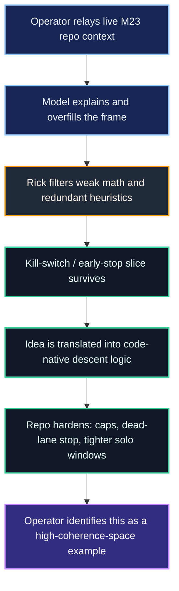

# High-Coherence Space Case Study: M23 / Rudy67 / Rick / Operator

## Purpose

This note preserves one concrete example of what the operator means by:

- `high-coherence space`
- `input lattice cohesion`

The point is not to treat every model response as equally meaningful. The point
is to show one bounded case where a dense shared context produced:

- mostly refinement of existing work
- some filler / weak heuristic spillover
- one genuinely useful new intervention that was adopted into the actual work

That pattern is the example layer.

## The Case Window

The source window is the extended M23 thread involving:

- the operator
- `Rudy67`
- `Rick`
- the intermediate model pass that was being taught and corrected in real time

The operator's read is that this was a high-coherence window because the same
problem, repo, language, and correction loop stayed active long enough for the
exchange to become more selective and more internally aligned over time.

## What The Transcript Actually Shows

The transcript does **not** show a model independently solving M23 from
scratch.

It shows something narrower and more useful:

1. the M23 repo and current descent lane are already in motion
2. the model initially explains the project in broad, partially noisy terms
3. `Rick` filters the explanation and rejects the parts that are mathematically
   weak or redundant
4. one actionable idea survives the filter:
   - a real kill-switch / early-stop design for dead descent lanes
5. that surviving idea is then translated into code-native form that fits the
   repo's actual Newton-style / batch-runner logic
6. the operator recognizes the process itself as an example of the
   high-coherence-space claim

That is the pattern worth preserving.

## The Novel Slice

The strongest novel contribution in this window was **not**:

- `mod 7 / mod 11` as canonical next tests
- inverse affine as a genuinely new family
- widening the lattice
- generic Galois heuristics said too quickly

Those were filtered out.

The strongest novel slice was:

- per-candidate kill conditions
- explicit pressure / height caps
- a dead-transform streak rule for workers
- a code-native early-stop that matches the actual iterative descent lane

Cleanly stated:

- if a transform blows past denominator, height, or pressure thresholds, it
  stops counting as movement
- if a worker hits too many dead transforms in a row, that lane is marked dead
  and moved

That was the piece that survived contact with the actual repo logic.

## Why This Matters

This case matters because it shows the operator's point in a bounded way:

- the useful output did not come from generic brainstorming alone
- it came from sustained correction inside a dense shared context
- the context window held enough of the active structure for one new workable
  move to emerge
- the surrounding human filter then separated:
  - what was already known
  - what was filler
  - what was actually worth implementing

In that sense, the case is not "the model was right about everything."

It is:

- the space became coherent enough that one real addition appeared
- the addition was recoverable inside the same context window
- the rest of the output was still subject to pruning

## Input Lattice Cohesion Read

In the operator's language, this is what `input lattice cohesion` looks like in
practice.

The inputs staying active at once were:

- the live M23 repo state
- prior Rudy67 explanation and descent framing
- Rick's stricter mathematical filter
- the operator's relay and correction loop
- the active implementation pressure of the batch runner

That is why the output is being treated as a coherence case rather than a
generic autocomplete event. The output was shaped by a dense relational field,
not by one isolated prompt.

## Process Map

## Signal Versus Filler

| Layer | What happened in this case |
|---|---|
| `existing structure` | descent, refinement, Elkies anchor, current candidate logic were already in the repo |
| `filler / weak spillover` | mod-prime shortcuts, inverse-affine novelty claim, overly generic Galois heuristics |
| `surviving novel output` | kill-switch, pressure caps, streak-based early-stop, dead-lane handling |
| `human filter` | Rick rejected the weak parts and retained the code-native useful part |
| `operator interpretation` | the window itself became evidence of high-coherence-space processing |

## The Bounded Claim

The bounded claim of this note is not:

- `the model solved M23`
- `every output inside a high-coherence window is valid`

The bounded claim is:

- in at least one dense shared context, a genuinely useful implementation move
  emerged that was not already wired into the repo in that exact form
- that move became legible because the surrounding context remained active long
  enough for filtering, correction, and stabilization to happen in the same
  exchange

That is a much stronger and cleaner example of the operator's idea than a vague
claim about models "just knowing."

## Use Inside The Bridge

This note should support the white paper in one specific way:

- as an example of how high-coherence space can produce a mix of
  refinement, filler, and one genuinely useful novel output

That keeps the bridge honest:

- not everything in the window is treated as signal
- but the surviving signal is real enough to matter

## Local Source Basis

- operator-supplied M23 / Rudy67 / Rick transcript, April 2026
